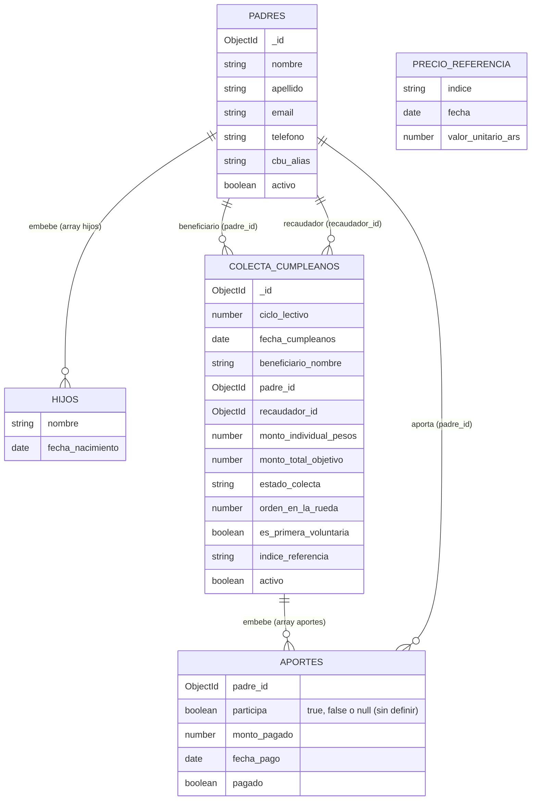

# Trabajo Final Integrador

**Trabajo Final UTN**
**ColectaApp — Plataforma de Colectas Indexadas y Circulares**

> **Trabajo Integrador Final (TIF)**
> **Carrera:** Tecnicatura Universitaria en Programación a distancia — UTN
> **Integrantes:** Pablo De La Puente, Eugenia Demarchi y Cintia García
> **Tutora:** Sofía Carnevale
> **Estado:** En desarrollo — 2.ª Entrega (Diseño y Módulos)

---

## 📌 Descripción del Proyecto

En contextos económicos de alta inflación, la gestión manual de colectas periódicas para cumpleaños escolares presenta inconvenientes como pérdida del poder adquisitivo, falta de transparencia, cálculos erróneos y desgaste del rol del recaudador.

**ColectaApp** es una plataforma web destinada a facilitar la gestión de colectas de cumpleaños dentro de un grupo escolar. La aplicación permite administrar un circuito permanente de participantes, generar automáticamente las colectas correspondientes a cada cumpleaños y determinar el importe a aportar mediante unidades de referencia configurables.

El sistema busca reducir el trabajo manual realizado actualmente mediante planillas de cálculo, facilitando el registro de participantes, la determinación del importe correspondiente a cada colecta y el seguimiento de los aportes realizados.

El caso de uso inicial del proyecto es un grupo de padres de un colegio, donde se gestionan las colectas de cumpleaños de los alumnos durante el ciclo lectivo.

**Alcance:** ColectaApp no procesa pagos ni realiza transferencias. Los aportes se realizan por fuera de la plataforma y el recaudador registra en el sistema los aportes recibidos.

---

## 🎯 Objetivos del Proyecto

**Objetivo general:** desarrollar una plataforma web que automatice la gestión de colectas de cumpleaños circulares entre grupos de padres de un colegio, protegiendo el valor económico del aporte frente a la inflación mediante unidades de referencia configurables.

**Objetivos específicos:**

* Diseñar un modelo de participantes que permita la participación opcional e independiente en cada colecta.
* Automatizar la generación de colectas a partir de un calendario de cumpleaños cargado por el administrador.
* Implementar un mecanismo de indexación que fije el importe a aportar en unidades de referencia (no en pesos), congelando su valor en ARS el día hábil anterior a cada colecta.
* Incorporar control de acceso basado en roles (Administrador, Participante — "Recaudador" es una condición rotativa del Participante, no un rol de acceso) mediante autenticación segura.
* Garantizar trazabilidad histórica de participantes y aportes, aun cuando un participante deje de pertenecer al grupo.

---

## ✨ Características Principales

* **Gestión de participantes:** los padres pertenecen al grupo de forma permanente mientras continúen formando parte del mismo. Pueden participar o no participar individualmente en cada colecta.
* **Invitación y registro de usuarios:** el administrador incorpora a los padres al grupo mediante una invitación. El participante completa sus datos y establece su contraseña para crear su cuenta.
* **Gestión de cumpleaños:** el administrador carga manualmente el calendario de cumpleaños de los alumnos.
* **Generación automática de colectas:** a partir del calendario de cumpleaños, el sistema genera automáticamente una colecta para cada cumpleaños, evitando que el administrador tenga que crear cada colecta manualmente.
* **Aportes indexados mediante unidades de referencia:** el grupo puede establecer una unidad de referencia para determinar el importe a aportar (ej.: 5 litros de nafta súper por participante).
* **Congelamiento de Valor Automático:** el sistema ejecuta un proceso programado que fija el valor exacto en pesos argentinos (ARS) el día hábil anterior a la colecta.
* **Participación individual:** para cada colecta, cada participante decide si desea participar o no. La decisión es independiente de las demás colectas. Esa decisión, y el estado de pago, son visibles únicamente para el propio participante y para el recaudador de esa colecta — el resto del grupo no ve el estado de nadie más (ver "Decisiones de diseño cerradas en la 2.ª Entrega").
* **Gestión de recaudadores:** el recaudador de cada colecta no se asigna manualmente: se resuelve por regla de negocio (ver "Decisiones de diseño cerradas en la 2.ª Entrega"). Es el único, dentro de esa colecta puntual, que puede consultar el estado de todos los participantes (quién participa, quién no, quién ya pagó) y un resumen agregado de lo recaudado frente al objetivo.
* **Notificaciones y recordatorios:** _fuera del MVP_ — el monto congelado y el CBU/alias del recaudador se muestran en pantalla al participante; el envío automático de avisos por mail/push queda documentado como ampliación futura (Módulo 7, ver "Módulos del Backend").
* **Trazabilidad e historial:** se conserva el historial de participación y aportes. Los participantes que dejen de pertenecer al grupo serán desactivados, sin eliminar su información histórica.

---

## 🛠️ Arquitectura y Aspectos Técnicos

El desarrollo aborda los siguientes desafíos de ingeniería de software:

* **Patrón Strategy:** resuelve la obtención de cotizaciones de distintos índices de referencia (Nafta YPF, Dólar MEP, Cajita Feliz) mediante una interfaz `CotizacionStrategy` con una implementación por índice, sin acoplar el servicio de colectas a un índice particular.
* **Tareas programadas (Scheduler):** ejecución automática del congelamiento de valores de referencia el día hábil anterior a cada colecta. La generación de recordatorios queda fuera del MVP (ver "Módulos del Backend").
* **Seguridad y Control de Acceso:** autenticación mediante JWT, almacenamiento seguro de contraseñas y control de acceso basado en roles (RBAC).

---

## 🗂️ Esquema de la Base de Datos

Modelo documental en MongoDB Atlas, diseñado y aprobado en la cátedra de Bases de Datos II, sin modificaciones para esta entrega: tres colecciones — `padres` (con `hijos` embebidos), `colecta_cumpleanos` (con `aportes` embebidos) y `precio_referencia`. Detalle completo de campos, justificación de embedding/linking y datos de ejemplo en [`basedatosTPF/esquema_base_datos.md`](./basedatosTPF/esquema_base_datos.md).



> La relación entre `precio_referencia.indice` y `colecta_cumpleanos.indice_referencia` es lógica (por string), no por ObjectId, y no se representa arriba por no ser una referencia formal de la base.

> El campo `participa` en `aportes[]` es una extensión aditiva sobre el esquema ya aprobado en Bases de Datos II (no modifica ni elimina campos existentes): permite distinguir "decidió no participar" de "todavía no respondió", algo que antes solo se inferría de la ausencia de la entrada.

---

## 📦 Módulos del Backend (2.ª Entrega)

En base al esquema definido y a las reglas de negocio de este README, el backend se organiza en seis módulos funcionales para el MVP. Cada uno se detalla con su objetivo, clases principales y endpoints REST — a modo de contrato de API, para poder arrancar el frontend con datos mock que respeten la misma forma que las respuestas reales.

### Módulo 1 · Autenticación y Roles
Gestiona el acceso y diferencia permisos. Roles de sistema: `ADMINISTRADOR` y `PARTICIPANTE` ("Recaudador" no es un rol de acceso, es una condición rotativa determinada por `recaudador_id`). Alta por invitación (link/QR) con registro propio del padre.
**Clases:** `AuthController`, `JwtService`, `SecurityConfig`, `Rol` (enum), `InvitacionService`.
```
POST   /api/auth/invitaciones
POST   /api/auth/registro
POST   /api/auth/login
GET    /api/auth/me
```

### Módulo 2 · Participantes
Administra padres e hijos (beneficiarios) embebidos. Baja lógica vía `activo`.
**Clases:** `Participante`, `Beneficiario`, `ParticipanteController`, `ParticipanteService`, `ParticipanteRepository`.
```
GET    /api/participantes
GET    /api/participantes/{id}
PUT    /api/participantes/{id}
PATCH  /api/participantes/{id}/baja
POST   /api/participantes/{id}/beneficiarios
PUT    /api/participantes/{id}/beneficiarios/{beneficiarioId}
```

### Módulo 3 · Colectas
Crea y da seguimiento a cada colecta dentro de la rueda circular anual, incluyendo la asignación del recaudador (ver decisión cerrada más abajo).
**Clases:** `ColectaCumpleanos`, `CicloLectivo`, `ColectaController`, `ColectaService`, `AsignacionRecaudadorService`.
```
POST   /api/ciclos
GET    /api/colectas?ciclo=2026
GET    /api/colectas/{id}
POST   /api/colectas/{id}/postular-voluntario
GET    /api/colectas/{id}/recaudador
```

> El `recaudador_id` que asigna este módulo es la base del chequeo de autorización del Módulo 6: quién puede ver el estado de todos los aportes de una colecta se resuelve comparando el usuario logueado contra este campo, no con el rol genérico de JWT.

### Módulo 4 · Índices de Referencia (patrón Strategy)
Resuelve la cotización de cada índice sin acoplar el servicio de colectas a uno en particular. El índice se fija por votación entre los participantes al invitarse.
**Clases:** `CotizacionStrategy` (interfaz), `NaftaYpfStrategy`, `DolarMepStrategy`, `CajitaFelizStrategy`, `IndiceReferenciaController`, `VotacionIndiceService`.
```
GET    /api/indices
POST   /api/indices/votar
GET    /api/indices/{indice}/cotizacion-actual
```

### Módulo 5 · Congelamiento de Montos
Scheduler/Cron Job que fija el valor en pesos el día hábil previo a cada colecta, persistiéndolo en `precio_referencia` y en `monto_individual_pesos`.
**Clases:** `CongelamientoScheduler`, `PrecioReferencia`, `CongelamientoService`.
```
GET    /api/precios-referencia?indice=nafta_ypf&fecha=2026-06-29
POST   /api/precios-referencia/congelar/{colectaId}
```

### Módulo 6 · Aportes y Pagos
Registra la decisión de participación (`participa`) y el estado de pago de cada participante por colecta, resolviendo el problema de transparencia planteado en la propuesta original. Aplica una regla de visibilidad por autorización a nivel de recurso: cada participante ve únicamente su propia entrada; solo el recaudador de esa colecta puntual (`recaudador_id`, Módulo 3) puede ver el estado de todos y el resumen agregado. Este filtro se resuelve siempre en el backend — nunca alcanza con ocultarlo en el frontend, porque la respuesta completa quedaría expuesta a cualquiera que inspeccione la llamada a la API.
**Clases:** `Aporte` (embebido, con campo `participa`), `AporteController`, `AporteService`, `ReporteDeudaService`.
```
GET    /api/colectas/{id}/aportes              # recaudador: array completo · participante: solo su propia entrada
PATCH  /api/colectas/{id}/aportes/{padreId}     # registra decisión de participación y/o marca el pago
GET    /api/colectas/{id}/deuda-pendiente       # solo recaudador
GET    /api/colectas/{id}/resumen               # solo recaudador: recaudado vs. monto_total_objetivo, cantidad de pendientes
```

### Fuera de alcance del MVP

**Módulo 7 · Notificaciones** — automatizar los recordatorios de pago vía mail/push, disparados tras el congelamiento (Módulo 5). Documentado como ampliación futura incremental; no requiere cambios en el esquema de datos.

### Responsables por módulo

Reparto de horas y checklist de avance por persona: ver [`PLAN_DE_TRABAJO.md`](./PLAN_DE_TRABAJO.md).

---

## 🏗️ Stack Tecnológico Proyectado

| Componente | Tecnología / Proveedor | Descripción |
|---|---|---|
| **Frontend** | React + TypeScript | Permite desarrollar rápidamente una interfaz web modular y tiene abundante documentación y recursos disponibles. |
| **Backend** | Java + Spring Boot | Permite mantener Java y aplicar POO. Spring Data MongoDB facilita la integración del backend con MongoDB. |
| **Gestor de dependencias** | Gradle | Permite gestionar las dependencias y automatizar la construcción del proyecto de forma sencilla. |
| **API** | REST | Enfoque simple y ampliamente utilizado para comunicar frontend y backend mediante HTTP y JSON. |
| **Base de datos** | MongoDB Atlas | Permite utilizar MongoDB en la nube sin tener que administrar un servidor de base de datos propio. |
| **Despliegue Frontend** | Netlify | Facilita el despliegue del frontend directamente desde GitHub, con integración continua por rama. |
| **Despliegue Backend** | Render | Permite desplegar el backend sin administrar un servidor propio. Se evaluará el uso de Docker solo si fuera necesario. |
| **Control de versiones** | Git + GitHub | Permite trabajar colaborativamente y cumplir con el requisito de un único repositorio para todo el proyecto. |

---

## ☁️ Despliegue

| Componente | URL |
|---|---|
| Frontend (Netlify) | _pendiente de despliegue_ |
| Backend (Render) | _pendiente de despliegue_ |
| Base de datos (MongoDB Atlas) | Cluster M0 — configurado |

---

## 📂 Estructura del Repositorio

```text
colectaapp/
│
├── frontend/              # React + TypeScript
│   ├── src/
│   └── public/
│
├── backend/               # Java + Spring Boot
│   ├── src/
│   │   ├── main/
│   │   └── test/
│   └── build.gradle
│
├── basedatosTPF/          # Esquema de datos y exports de ejemplo (Mongo)
│   ├── esquema_base_datos.md
│   ├── gestion_cumpleanos.padres.json
│   ├── gestion_cumpleanos.colecta_cumpleanos.json
│   └── gestion_cumpleanos.precio_referencia.json
│
├── .gitignore
├── LICENSE
└── README.md
```

---

## 🗓️ Plan de Trabajo

| Entrega | Fecha | Alcance |
|---|---|---|
| **1.ª Entrega** | 30/08 | Propuesta del proyecto, definición de alcance (caso de uso escolar), stack tecnológico proyectado y repositorio único de GitHub con los tres integrantes como colaboradores. |
| **2.ª Entrega** | 27/09 | Diseño y listado de módulos del backend, modelo de datos definitivo y cierre de las decisiones de diseño (ver "Esquema de la Base de Datos", "Módulos del Backend" y más abajo). |
| **Entrega Final** | 14/11 | Aplicación funcional desplegada (frontend en Netlify, backend en Render), documentación completa y defensa oral. |

### Decisiones de diseño cerradas en la 2.ª Entrega

* **Asignación del recaudador por colecta:** la primera colecta del ciclo lectivo la organiza un participante voluntario (`es_primera_voluntaria: true`); si se postula más de uno, se asigna al que se postuló primero por orden cronológico. A partir de ahí, el padre cuyo hijo ya recibió la colecta anterior pasa a ser el `recaudador_id` de la colecta siguiente, sosteniendo la lógica de cadena circular. El padre beneficiario de una colecta no aporta económicamente a la colecta de su propio hijo.
* **Alcance de las notificaciones:** quedan **fuera del MVP** de la Entrega Final y se documentan como ampliación futura (Módulo 7). El monto congelado y el CBU/alias del recaudador se muestran en pantalla, cubriendo la necesidad funcional sin sumar una dependencia externa de envío de mail/push al alcance del TIF.
* **Visibilidad del estado de aportes:** dentro de una colecta puntual, cada participante ve únicamente su propio estado (si participa o no, si ya pagó o no); el recaudador de esa colecta es el único que ve el estado de todos y el resumen agregado (Módulo 6). Es una sola regla de autorización a nivel de recurso — no un caso especial para "esconder a los que dijeron que no" — que de paso evita que se pueda deducir por eliminación quién declinó participar.

---

## 👥 Integrantes

| Nombre | Usuario de GitHub |
|---|---|
| Pablo De La Puente | https://github.com/JohnTheMano |
| Eugenia Demarchi | https://github.com/EugeniaDemarchi |
| Cintia García | https://github.com/Cigarcia1307 |


---

